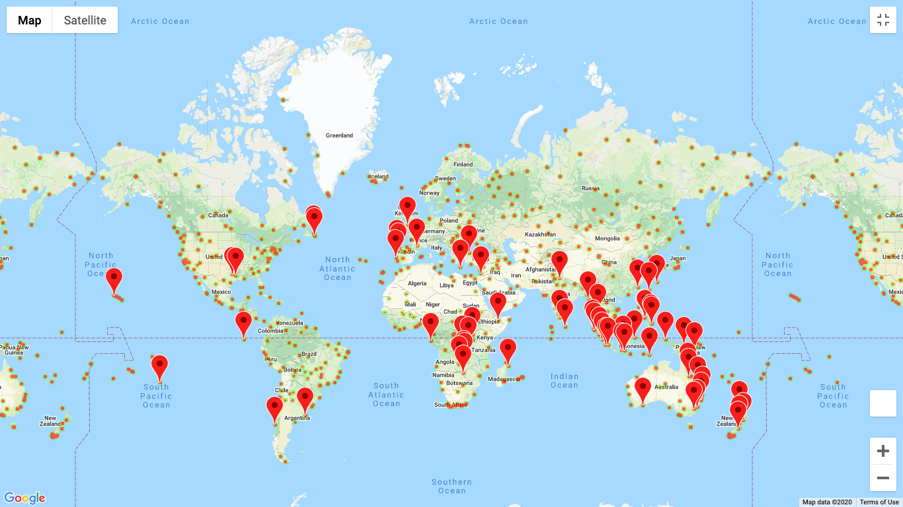
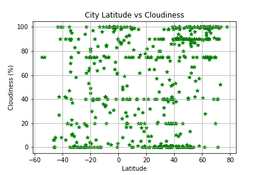
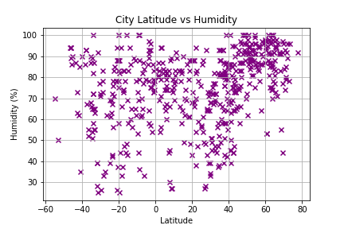
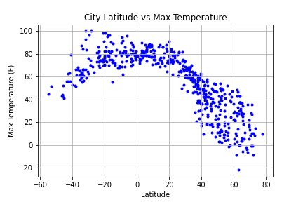
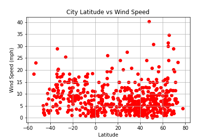

Weather Mapping

Have you ever wondered where warmer these so-called warm climate zones exist? Can't wait to get away from all the snow during winter time? Then I have just the project for you!

I analyze over 500 randomly chosen cities around the world and observe the temperatures, humidity, cloudiness, and wind speeds in each of these cities. As you may ahve guessed, some of the warmest places to live tend to gather around the equator.

I create scatter plots to show all of these trends, and use heat maps emphasize my work.

